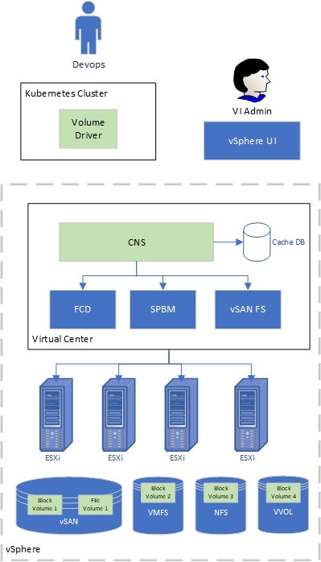

Support for Cloud Native Storage (CNS) on TKGI Clusters with Stateful Application Example
=========================================================================================

[Support for Cloud Native Storage (CNS) on TKGI Clusters with Stateful
Application Example
1](#support-for-cloud-native-storage-cns-on-tkgi-clusters-with-stateful-application-example)

[Introduction 1](#introduction)

[Overview 1](#overview)

[Prerequisites for CNS with TGKI 3](#prerequisites-for-cns-with-tgki)

[Install CSI Driver on a TGKI Cluster
3](#install-csi-driver-on-a-tgki-cluster)

[Deploy Stateful Containerized Application 8](#_Toc45744663)

[Install Velero Backup/Restore product w/support for CSI volume
snapshots
12](#install-velero-backuprestore-product-wsupport-for-csi-volume-snapshots)

[Backup Stateful App with vSphere Volume Snapshot
14](#backup-stateful-app-with-vsphere-volume-snapshot)

[Delete & Restore Stateful App from Backup with vSphere Volume Snapshot
15](#delete-restore-stateful-app-from-backup-with-vsphere-volume-snapshot)

[Troubleshooting Notes 17](#troubleshooting-notes)

[Conclusion 19](#conclusion)

Introduction 
------------

This document is a quick start guide for enabling CNS volume support on
a Tanzu Kubernetes Grid Integrated (TKGI, formerly known as Enterprise
PKS) Kubernetes clusters and deploying applications that use persistent
volumes. This document will provide details on configuration of CSI
drivers in designated K8s cluster, deployment a stateful application
using K8s storage class with CSI driver. Finally, there is an overview of 
steps to back up/restoring that aplication using Velero open source solution.

Note: thanks to [Alexander
Ullah](mailto:aullah@vmware.com?subject=Thanks%20for%20publishing%20TKG*%20CSI%20%22how%20to%22%20blog!)
for creating a very helpful \"how to\"
[blog](https://beyondelastic.com/2020/04/30/backup-and-migrate-tkgi-pks-to-tkg-with-velero/)
for workload migration between K8s clusters with CSI which I took
definition of the stateful [Ghost
application](https://github.com/beyondelastic/velero_vSphere) from.

Overview
--------

Cloud Native Storage (CNS) provides comprehensive data management for
stateful, containerized apps, enabling apps to survive restarts and
outages.

CNS vSphere offers the following two components:

-   CNS in vCenter Server

-   vSphere volume driver in Kubernetes

CNS control plane introduces a concept of volumes: **container volumes
and persistent volumes** in vSphere - it is the Storage control plane
for container volumes. CNS is responsible for managing the lifecycle of
volumes, including such operations as create, read, update, and delete.

It is also responsible for managing volume metadata, snapshot and
restore, volume copy and clone, as well as monitoring the health and
compliance of volumes.

These volumes are independent of the virtual machine lifecycle and have
their own identity in vSphere.

CNS supports block volumes backed by First Class Disk (FCD) and file
volumes backed by vSAN file shares.

A ***block volume*** can only be attached to one Kubernetes pod with
***ReadWriteOnce*** access mode at any point in time. A ***file
volume*** can be attached to one or more pods with
***ReadWriteMany/ReadOnlyMany*** access modes.

In Kubernetes, CNS provides a volume driver that has two sub-components:
the **CSI driver** and the **syncer**.

-   The **CSI driver** is responsible for volume provisioning, attaching
    and detaching the volume to VMs, mounting, formatting and unmounting
    volumes from the pod within the node VM, etc.The CSI driver is built
    as an out-of-tree CSI plugin for Kubernetes.

-   The **syncer** is responsible for pushing PV, PVC, and pod metadata
    to CNS. It also has a CNS operator that is used in the context of
    vSphere with Kubernetes (formerly "Project Pacific").

Stateful containers can use vSphere storage primitives - standard
volume, persistent volume, and dynamic provisioning - independent of VM
and container lifecycle. vSphere storage backs the volumes, and we can
set a storage policy directly on the volumes.

After creation of volumes, we can review them and their backing virtual
disks, and monitor their storage policy compliance via use vSphere
client.

Prerequisites for CNS with TGKI
-------------------------------

(See <https://docs.pivotal.io/pks/1-7/vsphere-cns.html> for complete
list of pre-requisites)

Install CSI Driver on a TGKI Cluster
------------------------------------

Follow documentation: <https://docs.pivotal.io/pks/1-7/vsphere-cns.html>
and use sample files provided

(provided input to Docs team for some inaccuracies which were corrected)

1.  Create CSI Secret based on provided sample deployment file
    (*csi-vsphere.conf*)

> \[Global\]
>
> cluster-id = PKS-COMPUTE-EDGES
>
> \[VirtualCenter \"192.168.2.20\"\]
>
> insecure-flag = \"true\"
>
> user = \"administrator\@vsphere.local\"
>
> password = \"XXXXXX\"
>
> port = \"443\"
>
> datacenters = \"PKS-NESTED-DC2\"

NOTES:

> *cluster-id* is a unique identifier, can be a name of vSphere cluster
> which data store will be used
>
> *VirtualCenter* contains IP address (FQDN) of vSphere vCenter
>
> *user* and *password* are credentials of vSphere admin user (or user
> with sufficient access level)
>
> *datacenters* are vSphere Data center(s) where clusters are contained
>
> Create a secret for accessing vSphere Data Center/Cluster
>
> **kubectl create secret generic vsphere-config-secret
> \--from-file=csi-vsphere.conf \--namespace=kube-system**
>
> secret/vsphere-config-secret created

2.  Create RBAC objects for CSI access based on provided sample
    deployment file (*vsphere-csi-controller-rbac.yaml* included into
    'samples' repository folder, partially shown below)
```yaml
kind: ServiceAccount
apiVersion: v1
metadata:
  name: vsphere-csi-controller
  namespace: kube-system
---
kind: ClusterRole
apiVersion: rbac.authorization.k8s.io/v1
metadata:
  name: vsphere-csi-controller-role
rules:
  - apiGroups: [""]
    resources: ["nodes", "persistentvolumeclaims", "pods"]
    verbs: ["get", "list", "watch"]
  - apiGroups: [""]
    resources: ["persistentvolumes"]
    verbs: ["get", "list", "watch", "create", "update", "delete"]
  - apiGroups: [""]
    resources: ["events"]
    verbs: ["get", "list", "watch", "create", "update", "patch"]
  - apiGroups: ["storage.k8s.io"]
    resources: ["storageclasses"]
    verbs: ["get", "list", "watch"]
  - apiGroups: ["storage.k8s.io"]
    resources: ["csinodes"]
    verbs: ["get", "list", "watch"]
  - apiGroups: ["storage.k8s.io"]
    resources: ["volumeattachments"]
    verbs: ["get", "list", "watch", "update"]
---
kind: ClusterRoleBinding
apiVersion: rbac.authorization.k8s.io/v1
metadata:
  name: vsphere-csi-controller-binding
subjects:
  - kind: ServiceAccount
    name: vsphere-csi-controller
    namespace: kube-system
roleRef:
  kind: ClusterRole
  name: vsphere-csi-controller-role
  apiGroup: rbac.authorization.k8s.io
```
> **kubectl apply -f vsphere-csi-controller-rbac.yaml**
>
> serviceaccount/vsphere-csi-controller created\
> clusterrole.rbac.authorization.k8s.io/vsphere-csi-controller-role
> created\
> clusterrolebinding.rbac.authorization.k8s.io/vsphere-csi-controller-binding
> created
>
> Verify that service account, cluster roles/cluster role binding exist
> in 'kube-system' namespace:
>
> **kubectl get serviceaccounts -n kube-system**
>
> \.....
>
> vrealize-med01                       1         25h
>
> **vsphere-csi-controller               1         3m4s**
>
> **kubectl get clusterroles -n kube-system**
>
> vrops-cadvisor                                                        
> 47h
>
> **vsphere-csi-controller-role                                   \<invalid\>**
>
> **kubectl get clusterrolebindings -n kube-system**
>
> vrops-cadvisor                                         47h
>
> **vsphere-csi-controller-binding                         \<invalid\>**

3.  Install the vSphere CSI Driver using sample manifest file
    (*vsphere-csi-controller-ss.yaml* included into 'samples' repository
    folder)

> **kubectl apply -f vsphere-csi-controller-ss.yaml**\
> statefulset.apps/vsphere-csi-controller created\
> csidriver.storage.k8s.io/csi.vsphere.vmware.com created

    Optionally, monitor events in kube-system namespace to check
initialization of vsphere-csi-controller:

> **kubectl get events -n kube-system**
>
> LAST SEEN   TYPE     REASON            
> OBJECT                               MESSAGE\
> \<unknown\>   Normal   Scheduled         
> pod/vsphere-csi-controller-0         Successfully assigned
> kube-system/vsphere-csi-controller-0 to
> a208e18a-fbe4-4e36-a17f-6efe7c204d78\
> 27s         Normal   Pulling           
> pod/vsphere-csi-controller-0         Pulling image
> \"[quay.io/k8scsi/csi-attacher:v1.1.1](http://quay.io/k8scsi/csi-attacher:v1.1.1)\"\
> 22s         Normal   Pulled            
> pod/vsphere-csi-controller-0         Successfully pulled image
> \"[quay.io/k8scsi/csi-attacher:v1.1.1](http://quay.io/k8scsi/csi-attacher:v1.1.1)\"\
> 20s         Normal   Created           
> pod/vsphere-csi-controller-0         Created container csi-attacher\
> 20s         Normal   Started           
> pod/vsphere-csi-controller-0         Started container csi-attacher\
> 20s         Normal   Pulling           
> pod/vsphere-csi-controller-0         Pulling image
> \"[gcr.io/cloud-provider-vsphere/csi/release/driver:v1.0.2](http://gcr.io/cloud-provider-vsphere/csi/release/driver:v1.0.2)\"\
> 7s          Normal   Pulled            
> pod/vsphere-csi-controller-0         Successfully pulled image
> \"[gcr.io/cloud-provider-vsphere/csi/release/driver:v1.0.2](http://gcr.io/cloud-provider-vsphere/csi/release/driver:v1.0.2)\"\
> 3s          Normal   Created           
> pod/vsphere-csi-controller-0         Created container
> vsphere-csi-controller\
> 2s          Normal   Started           
> pod/vsphere-csi-controller-0         Started container
> vsphere-csi-controller\
> 2s          Normal   Pulling           
> pod/vsphere-csi-controller-0         Pulling image
> \"[quay.io/k8scsi/livenessprobe:v1.1.0](http://quay.io/k8scsi/livenessprobe:v1.1.0)\"\
> 30s         Normal   SuccessfulCreate  
> statefulset/vsphere-csi-controller   create Pod
> vsphere-csi-controller-0 in StatefulSet vsphere-csi-controller
> successful

4.  Install CSI Driver DaemonSet using sample manifest file
    (*vsphere-csi-node-ds.yaml* included into 'samples' repository
    folder)

> **kubectl apply -f vsphere-csi-node-ds.yaml**
>
> daemonset.apps/vsphere-csi-node created
>
> Verify that DaemonSet (that is guaranteed Pod/Node) is running on all
> cluster nodes:
>
> **kubectl get ds -n kube-system**
>
> NAME      DESIRED   CURRENT   READY   UP-TO-DATE   AVAILABLE   NODE
> SELECTOR   AGE
>
> vsphere-csi-node   4         4         4       4           
> 4           \<none\>          2m8s

5.  Verify that CSI Driver Deployed Successfully

  Check that all pods are running in the kube-system namespace (look for
**vsphere-csi-...** pod names)

> **kubectl get po \--namespace=kube-system**
>
> NAME                              READY   STATUS            
> RESTARTS   AGE
>
> NAME READY STATUS RESTARTS AGE
>
> coredns-5b6649768f-7zzfr 1/1 Running 0 97m
>
> coredns-5b6649768f-8rg9m 1/1 Running 0 97m
>
> coredns-5b6649768f-c4ktq 1/1 Running 0 97m
>
> metrics-server-7f9887fbb5-64rtk 1/1 Running 0 97m
>
> **vsphere-csi-controller-0 5/5 Running 0 7m**
>
> **vsphere-csi-node-b47k4            3/3     Running           
> 0          5m45s**
>
> **vsphere-csi-node-cvcm2            3/3     Running           
> 0          5m45s**
>
> **vsphere-csi-node-fxfsj            3/3     Running           
> 0          5m45s**
>
> **vsphere-csi-node-p4wgc            3/3     Running           
> 0          5m45s**

6.  Verify that CRDs for CSI are deployed and working:

> **kubectl get CSINode**
>
> NAME                                   CREATED AT\
> 23f8a803-50de-4d2a-be42-5f4482f35fb3    2020-06-25T19:31:44Z\
> 3f178b02-514c-415d-9716-470b30175b44  2020-06-30T05:11:41Z\
> 576e0ba9-5621-4ecd-a1b1-eb39af781390   2020-06-25T19:31:42Z\
> 9dcd874c-c86e-4b59-af77-c914619fd38c    2020-06-10T19:23:29Z
>
> **kubectl describe CSINode**
>
> Name:         23f8a803-50de-4d2a-be42-5f4482f35fb3\
> Namespace:\
> Labels:       \<none\>\
> Annotations:  \<none\>\
> API Version:  [storage.k8s.io/v1beta1](http://storage.k8s.io/v1beta1)\
> Kind:         CSINode\
> Metadata:\
>   Creation Timestamp:  2020-06-25T19:31:44Z\
>   Owner References:\
>     API Version:     v1\
>     Kind:            Node\
>     Name:            23f8a803-50de-4d2a-be42-5f4482f35fb3\
>     UID:             2e495151-1a4a-4aac-baab-f5182b504e21\
>   Resource Version:  7801510\
>   Self Link:        
> /apis/[storage.k8s.io/v1beta1/csinodes/23f8a803-50de-4d2a-be42-5f4482f35fb3](http://storage.k8s.io/v1beta1/csinodes/23f8a803-50de-4d2a-be42-5f4482f35fb3)\
>   UID:               ef1d6c57-3965-499b-8493-5952e454dadc\
> Spec:\
>   Drivers:\
>     Name:          
> [csi.vsphere.vmware.com](http://csi.vsphere.vmware.com)\
>     Node ID:        23f8a803-50de-4d2a-be42-5f4482f35fb3\
>     Topology Keys:  \<nil\>\
> Events:             \<none\>\
> \
> \....

7.  Verification that CSI Driver is installed\
    \
    **kubectl get csidrivers**\
    NAME                     CREATED AT\
    csi.vsphere.vmware.com   2020-07-03T02:42:08Z

### 

8.  Verify that CSI ProviderID was added to all Cluster Nodes

> ** kubectl describe nodes \| grep \"ProviderID\"\*\***\
> ProviderID:                  
> vsphere://421c57b9-99bb-ef5a-c2d4-38b857f8d9d5\
> ProviderID:                  
> vsphere://421cef46-3327-d66c-4d52-5e6f2bb1bfaa\
> ProviderID:                  
> vsphere://421c04c4-13fd-069e-c2a9-d13166d81a4c\
> ProviderID:                  
> vsphere://421ce760-a829-deb2-82d9-45ff4fc5ec95
>
> Deploy Stateful Containerized Application
-------------------------------------------
>
> We will simple simple Ghost blogging application that preserves state
> using PVC (source code available from
> <https://github.com/beyondelastic/velero_vSphere>)

1.  Create storage class that is using CSI driver (using demo-csi-strage-class.yaml
    deployment descriptor file available in 'samples' folder)
```yaml
apiVersion: storage.k8s.io/v1
kind: StorageClass
metadata:
  name: demo-sts-sc
  annotations:
    storageclass.kubernetes.io/is-default-class: "true"
provisioner: csi.vsphere.vmware.com
parameters:
  datastoreurl: "ds:///vmfs/volumes/13e49faf-a5872633/"
```
> 
NOTE: datastoreurl should point to a folder in the associated vSphere
> data store:
>
> 
>
> **kubectl apply -f csi-sc-dan.yaml -n ghost**
>
> storageclass.storage.k8s.io/demo-sts-sc created
>
> Verify that storage class primitive has been created at K8s cluster
> level:
>
> **kubectl get sc**
>
> NAME PROVISIONER RECLAIMPOLICY VOLUMEBINDINGMODE ALLOWVOLUMEEXPANSION
> AGE
>
> demo-sts-sc (default) csi.vsphere.vmware.com Delete Immediate false
> 4m40s

2.  Create PVS using SC above and deploy Ghost app based on that PVC
    (ghost-claim.yaml sample deployment descriptor is included into the
    'samples' repository folder)
```yaml
kind: PersistentVolumeClaim
apiVersion: v1
metadata:
  name: blog-content-new
  namespace: ghost
  annotations:
    volume.beta.kubernetes.io/storage-class: demo-sts-sc
spec:
  accessModes:
    - ReadWriteOnce
  resources:
    requests:
      storage: 2Gi
```
>

> Run the following command:
>
> **kubectl apply -f ghost-claim.yaml**
>
> persistentvolumeclaim/blog-content-new created
>
> NOTE: on vSphere UI we can monitor tasks of creation of persistent
> volume:
>
> {width="6.653571741032371in"
> height="0.5741786964129484in"}
>
> Verify that PVC that volume are in "bound" state:
>
> **kubectl get pvc -n ghost**
>
> NAME               STATUS   VOLUME       CAPACITY   ACCESS MODES  
> STORAGECLASS   AGE
>
> ***blog-content-new   Bound   
> pvc-f9ec1bce-c2c1-4477-b118-e3b333a57151   2Gi        RWO   
> demo-sts-sc    119s***

3.  Deploy Ghost stateful application (using *ghost-new.yaml* sample
    deployment descriptor file found in the 'samples' folder, shown
    below):
```yaml
apiVersion: v1
kind: Service
metadata:
  labels:
    name: blog
  name: blog
  namespace: ghost
spec:
  ports:
    - port: 80
      targetPort: 2368
  selector:
    app: blog
  type: LoadBalancer

---

apiVersion: apps/v1
kind: Deployment
metadata:
  name: blog
  namespace: ghost
  labels:
    app: blog
spec:
  replicas: 1
  selector:
    matchLabels:
      app: blog
  template:
    metadata:
      labels:
        app: blog
    spec:
      containers:
      - name: blog
        image: ghost:latest
        imagePullPolicy: Always
        ports:
        - containerPort: 2368
        env:
        - name: url
          value: http://my-blog.acelab.local
        volumeMounts:
        - mountPath: /var/lib/ghost/content
          name: content
      volumes:
      - name: content
        persistentVolumeClaim:
          claimName: blog-content-new

```
> NOTES:
> - Value of 'url' environment variable should have a DNS record 
> - 'claimName' should match name of PVC created in earlier steps

\-\-\-\-\-\-\-\-\-\-\-\-\-\-\-\-\-\-\-\-\-\-\-\-\-\-\-\-\-\-\-\-\-\-\-\-\-\-\-\-\-\-\-\-\-\-\--

**kubectl apply -f ghost-new.yaml**

> service/blog created
>
> deployment.apps/blog created

4.  Verify that all application objects have been created in the
    designated K8s namespace:

> **kubectl get all -n ghost**
>
> NAME                        READY   STATUS    RESTARTS   AGE
>
> pod/blog-8646cd4d56-fpqz9   1/1     Running   0          10m
>
> NAME           TYPE           CLUSTER-IP       EXTERNAL-IP    
> PORT(S)        AGE
>
> service/blog   LoadBalancer   10.100.200.102   192.168.74.81  
> 80:35713/TCP   10m
>
> NAME          READY   UP-TO-DATE   AVAILABLE   AGE
>
> deployment.apps/blog   1/1     1            1           10m

.......

Navigate to the URL defined by EXTERNAL-IP address of LoadBalancer
service:

> 

> Now we can start using the Blog application as it is intedned --
> posting blogs etc.

Install Velero Backup/Restore product w/support for CSI volume snapshots
------------------------------------------------------------------------

1.  Install miniIO for local object store using [Helm3
    chart](https://bitnami.com/stack/minio/helm) from VMware Bitnami:

> helm install minio-release -n minio \\
>
> \--set access.Key.password=minio \\
>
> \--set secretKey.password=minio123 \\
>
> \--set persistence.storageClass=thin-disk \\
>
> bitnami/minio
>
> NOTE: If access.Key.password and secretKey.password values are
> different from those passed into Helm chart, you can retrieve their
> values by:
>
> **export MINIO\_ACCESS\_KEY=\$(kubectl get secret \--namespace minio
> minio-release -o jsonpath=\"{.data.access-key}\" \| base64
> \--decode)**
>
> **export MINIO\_SECRET\_KEY=\$(kubectl get secret \--namespace minio
> minio-release -o jsonpath=\"{.data.secret-key}\" \| base64
> \--decode)**
>
> **\
> **use outputs of those commands in **credentials** file to provide
> access to S3 object store (minIO) used in the script below:
>
> \[default\]
>
>   aws\_access\_key\_id=mtTK1JFdwQ
>
>   aws\_secret\_access\_key=minio123

2.  Use the following command script to install Velero w/support for
    CSI:

> export BUCKET=velero\
> export REGION=minio\
> ./velero install  \\\
>   \--provider aws \\\
>   \--bucket \$BUCKET \\\
>   \--secret-file ./credentials \\\
>   \--backup-location-config
> region=\$REGION,s3ForcePathStyle=\"true\",s3Url=<http://192.168.74.104>
> \\\
>   \--snapshot-location-config region=\$REGION \\\
>   \--plugins velero/velero-plugin-for-aws:v1.1.0
>
> Follow <https://github.com/vmware-tanzu/velero-plugin-for-vsphere> to
> install vSphere snapshot plugin (v 1.0.1!)

3.  Add vSphere volume snapshot plugin

> **velero plugin add
> vsphereveleroplugin/velero-plugin-for-vsphere:1.0.1**
>
> and create vSphere volume snapshot location:
>
> **velero snapshot-location create vsl-vsphere-dz \--provider
> [velero.io/vsphere](http://velero.io/vsphere)**
>
> Snapshot volume location \"vsl-vsphere-dz\" configured successfully.\
> \
> (Steps below are optional)
>
> verify that snapshot location has been created:
>
> **velero snapshot-location get**\
> NAME                PROVIDER\
> default               aws\
> vsl-vsphere-dz   [velero.io/vsphere](http://velero.io/vsphere)

        Optionally, verify that all pods, including  \"datamgr.\" to
handle volume snapshots,  are running in the velero namespace:

> **kubectl get po -n velero**
>
> NAME                                   READY   STATUS             
> RESTARTS   AGE
>
> pod/datamgr-for-vsphere-plugin-d5hbl   0/1     ContainerCreating  
> 0          4m22s
>
> pod/datamgr-for-vsphere-plugin-lmrpw   1/1     Running            
> 0          4m22s
>
> pod/datamgr-for-vsphere-plugin-mwgcv   1/1     Running            
> 0          4m22s
>
> pod/velero-5f8889f694-8whdz            1/1     Running            
> 0          10m

 Backup Stateful App with vSphere Volume Snapshot
------------------------------------------------

1.  Using volume snapshot above, initiate backup of stateful application
    Ghost namespace configured earlier:

> velero backup create ghost-backup3 \--include-namespaces=ghost
> \--snapshot-volumes \--volume-snapshot-locations vsl-vsphere-dz
>
> Backup request \"ghost-backup1\" submitted successfully.
>
> Run \`velero backup describe ghost-backup1\` or \`velero backup logs
> ghost-backup1\` for more details.

2.  Verify that backup completed successfully and volume snapshots were
    inlcuded:

> velero describe backup ghost-backup3 \--details
>
> \-\-\-\-\-\-\-\-\-\-\-\-\-\-\-\-\-\-\-\-\-\-\-\-\-\-\-\-\-\-\-\-\-\-\-\-\-\-\-\-\-\-\-\-\-\-\-\-\-\-\-\-\-\--\
> Name:         ghost-backup3\
> Namespace:    velero\
> Labels:       velero.io/storage-location=default\
> Annotations: 
> velero.io/source-cluster-k8s-gitversion=v1.16.7+vmware.1\
>               velero.io/source-cluster-k8s-major-version=1\
>               velero.io/source-cluster-k8s-minor-version=16\
> \
> Phase:  Completed\
> Namespaces:\
> **  Included:  ghost**\
>   Excluded:  \<none\>\
> \
> Resources:\
>   Included:        \*\
>   Excluded:        \<none\>\
>   Cluster-scoped:  auto\
> \
> Label selector:  \<none\>\
> Storage Location:  default\
> **Velero-Native Snapshot PVs:  true**\
> TTL:  720h0m0s\
> Hooks:  \<none\>\
> Backup Format Version:  1\
> Started:    2020-07-07 19:19:55 +0000 UTC\
> Completed:  2020-07-07 19:20:35 +0000 UTC\
> \
> Expiration:  2020-08-06 19:19:55 +0000 UTC\
> **Total items to be backed up:  10**\
> **Items backed up:              10**\
> \
> Resource List:\
>   apps/v1/Deployment:\
>     - ghost/blog\
>   apps/v1/ReplicaSet:\
>     - ghost/blog-8646cd4d56\
>   v1/Endpoints:\
>     - ghost/blog\
>   v1/Namespace:\
>     - ghost\
>   **v1/PersistentVolume:**\
>     - **pvc-f9ec1bce-c2c1-4477-b118-e3b333a57151**\
>   v1/PersistentVolumeClaim:\
>     - ghost/blog-content-new\
>   v1/Pod:\
>     - ghost/blog-8646cd4d56-fpqz9\
>   v1/Secret:\
>     - ghost/default-token-c6zpx\
>   v1/Service:\
>     - ghost/blog\
>   v1/ServiceAccount:\
>     - ghost/default\
> \
> Velero-Native Snapshots:\
>   **pvc-f9ec1bce-c2c1-4477-b118-e3b333a57151**:\
>     Snapshot ID:       
> ivd:be575613-2aae-4823-9e6d-16d4ce3a6fca:651985e4-642a-4a78-93e3-976f566d652d\
>     Type:               ivd\
>     Availability Zone:\
>     IOPS:               100\
> \-\-\-\-\-\-\-\-\-\-\-\-\-\-\-\-\-\-\-\-\-\-\-\-\-\-\-\-\-\-\-\-\-\-\-\-\-\-\-\-\-\-\-\-\-\-\--\
> NOTES:

-   notice the **PersistentVolume** object being included into the
    backup and corresponding Velero Native Snapshots, it should match
    the PVC ID of app created by deployment (see above)

-   uploading volume snapshots may take a long time due to many
    processes happening on the background, make sure to check backup
    upload status:

> **kubectl -n velero get uploads**

Delete & Restore Stateful App from Backup with vSphere Volume Snapshot
----------------------------------------------------------------------

1.  Delete namespace where app is deployed:

> **kubectl delete ns ghost**
>
> make sure the application namespace is fully deleted

2.  Initiate a restore process using previously created backup (with
    volume snapshots) :

> **velero restore create restore-ghost-backup3  \--from-backup
> ghost-backup3**
>
> Restore request "restore-ghost-backup3" submitted successfully.
>
> Run 'velero restore describe restore-ghost-backup3' or 'velero restore
> logs restore-ghost-backup3' for more details

3.  Monitor restore process status/check logs:

> **velero restore describe restore-ghost-backup3**\
> Name:         restore-ghost-backup3\
> Namespace:    velero\
> Labels:       \<none\>\
> Annotations:  \<none\>\
> Phase:  Completed\
> Backup:  ghost-backup3\
> \
> Namespaces:\
>   **Included:  all namespaces found in the backup**\
>   Excluded:  \<none\>\
> \
> Resources:\
>   Included:        \*\
>   Excluded:        nodes, events,
> [events.events.k8s.io](http://events.events.k8s.io),
> [backups.velero.io](http://backups.velero.io),
> [restores.velero.io](http://restores.velero.io),
> [resticrepositories.velero.io](http://resticrepositories.velero.io)\
>   Cluster-scoped:  auto\
> \
> Namespace mappings:  \<none\>\
> Label selector:  \<none\>\
> Restore PVs:  auto
>
> \-\-\-\-\-\-\-\-\-\-\-\-\-\-\-\-\-\-\-\-\-\-\--

4.  Check status of restored namespace, PVC, deployments, pods and
    services: 

> **kubectl get ns ghost**
>
> NAME    STATUS   AGE
>
> ghost   Active   3m37s
>
> **kubectl get pvc -n ghost**
>
> NAME                     STATUS  
> VOLUME                                                             
> CAPACITY   ACCESS MODES   STORAGECLASS   AGE
>
> blog-content-new   Bound    pvc-f9ec1bce-c2c1-4477-b118-e3b333a57151  
> 2Gi              RWO                     demo-sts-sc    5m41s \<==
> important to verify PVC is bound
>
> **kubectl get po,svc -n ghost**
>
> NAME                        READY   STATUS    RESTARTS   AGE
>
> pod/blog-8646cd4d56-fpqz9   1/1     Running   0          17m
>
> NAME           TYPE           CLUSTER-IP       EXTERNAL-IP    
> PORT(S)        AGE
>
> service/blog   LoadBalancer   10.100.200.246   **192.168.74.87**  
> 80:34241/TCP   17m
>
> \-\-\-\-\-\-\-\-\-\-\-\-\-\-\-\-\-\-\-\-\-\-\-\-\-\-\-\-\-\-\-\-\-\-\-\-\-\-\-\-\-\-\-\-\-\-\-\-\-\-\-\-\-\-\-\-\-\-\-\-\-\-\-\-\-\-\-\-\-\-\-\-\-\-\-\-\-\-\-\-\-\-\-\-\-\-\-\-\--
>
> Finally, navigate to the LoadBalancer URL of restored version of the
> Ghost app and check its availability (may need to update the DNS
> record matching URL specified in deployment descriptor):
>
> 

 Troubleshooting Notes
---------------------

1.  If validation of all Pods implementing CSI driver is failing (e.g.
    **vsphere-csi-controller** pod) is failing, examine pod logs for
    RCA:

> **kubectl logs vsphere-csi-controller-0 vsphere-csi-controller -n
> kube-system**
>
> I0702 20:16:00.623537       1 config.go:261\] GetCnsconfig called with
> cfgPath: /etc/cloud/csi-vsphere.conf\
> I0702 20:16:00.624455       1 config.go:206\] Initializing vc server
> your\_vc\_ip\
> I0702 20:16:00.624493       1 controller.go:67\] Initializing CNS
> controller\
> I0702 20:16:00.624663       1 virtualcentermanager.go:63\]
> Initializing defaultVirtualCenterManager\...\
> I0702 20:16:00.624736       1 virtualcentermanager.go:65\]
> Successfully initialized defaultVirtualCenterManager\
> I0702 20:16:00.624750       1 virtualcentermanager.go:107\]
> Successfully registered VC \"your\_vc\_ip\"\
> I0702 20:16:00.624878       1 manager.go:62\] Initializing
> volume.volumeManager\...\
> I0702 20:16:00.624885       1 manager.go:66\] volume.volumeManager
> initialized\
> E0702 20:16:00.643785       1 virtualcenter.go:127\] Failed to create
> new client with err: Post <https://your_vc_ip:443/sdk>: dial tcp:
> lookup your\_vc\_ip on 192.168.2.10:53: server misbehaving\
> E0702 20:16:00.644010       1 virtualcenter.go:238\] Failed to create
> govmomi client with err: Post <https://your_vc_ip:443/sdk>: dial tcp:
> lookup your\_vc\_ip on 192.168.2.10:53: server misbehaving\
> E0702 20:16:00.644251       1 virtualcenter.go:201\] Cannot connect to
> vCenter with err: Post <https://your_vc_ip:443/sdk>: dial tcp: lookup
> your\_vc\_ip on 192.168.2.10:53: server misbehaving\
> E0702 20:16:00.644408       1 util.go:41\] Failed to connect to
> VirtualCenter host: \"your\_vc\_ip\". err=Post
> <https://your_vc_ip:443/sdk>: dial tcp: lookup your\_vc\_ip on
> 192.168.2.10:53: server misbehaving\
> E0702 20:16:00.644575       1 controller.go:92\] Failed to get
> vcenter. err=Post <https://your_vc_ip:443/sdk>: **dial tcp: lookup
> your\_vc\_ip on 192.168.2.10:53: server misbehaving**\
> E0702 20:16:00.644617       1 service.go:107\] Failed to init
> controller. Error: Post <https://your_vc_ip:443/sdk>: dial tcp: lookup
> your\_vc\_ip on 192.168.2.10:53: server misbehaving\
> I0702 20:16:00.644726       1 service.go:88\] configured:
> [csi.vsphere.vmware.com](http://csi.vsphere.vmware.com) with
> map\[mode:controller\]\
> time=\"2020-07-02T20:16:00Z\" level=info msg=\"removed sock file\"
> path=/var/vcap/data/csi/sockets/pluginproxy/csi.sock\
> time=\"2020-07-02T20:16:00Z\" level=fatal msg=\"grpc failed\"
> error=\"Post <https://your_vc_ip:443/sdk>: dial tcp: lookup
> your\_vc\_ip on 192.168.2.10:53: server misbehaving\"\
> \-\-\-\-\-\-\-\-\-\-\-\-\-\-\-\-\-\-\-\-\-\-\-\-\-\--\
> **Resolution**: make sure that DNS server is running and listening on
> port 53, restart if needed
>
> 2\. Running backup using vSphere volume snapshot:
>
> **velero snapshot-location get**\
> NAME             PROVIDER\
> default          aws\
> \*vsl-vsphere-dz   [velero.io/vsphere](https://slack-redir.net/link?url=http%3A%2F%2Fvelero.io%2Fvsphere) 
>
> initiate velero backup using snapshot location:
>
> **velero backup create ghost-backup2 \--include-namespaces=ghost
> \--snapshot-volumes \--volume-snapshot-locations vsl-vsphere-dz**\
> Backup request \"ghost-backup2\" submitted successfully.
>
> Run \`velero backup describe ghost-backup2\` or \`velero backup logs
> ghost-backup2\` for more details.\
> \-\--\
> However, when running backup of stateful up using CSI volumes, I am
> getting the following exception:\
> time=\"2020-07-07T16:26:21Z\" level=error msg=\"Error getting volume
> snapshotter for volume snapshot location\" backup=velero/ghost-backup2
> error=\"unable to locate VolumeSnapshotter plugin
> named [**velero.io/vsphere**](https://slack-redir.net/link?url=http%3A%2F%2Fvelero.io%2Fvsphere)\"
> logSource=\"pkg/backup/item\_backupper.go:437\"
> name=pvc-f9ec1bce-c2c1-4477-b118-e3b333a57151 namespace=
> persistentVolume=pvc-f9ec1bce-c2c1-4477-b118-e3b333a57151
> resource=persistentvolumes volumeSnapshotLocation=vsl-vsphere-dz
>
> **Resolution**:  (worked after a few retries)
>
> 3\. Examine events when restoring application from backup:
>
> ** kubectl get events -n ghost**\
> LAST SEEN   TYPE      REASON                  
> OBJECT                      MESSAGE\
> \<unknown\>   Normal    Scheduled               
> pod/blog-8646cd4d56-fpqz9   Successfully assigned
> ghost/blog-8646cd4d56-fpqz9 to 576e0ba9-5621-4ecd-a1b1-eb39af781390\
> 14m         Normal    SuccessfulAttachVolume  
> pod/blog-8646cd4d56-fpqz9   AttachVolume.Attach succeeded for volume
> \"pvc-f9ec1bce-c2c1-4477-b118-e3b333a57151\"\
> 79s         Warning   FailedMount             
> pod/blog-8646cd4d56-fpqz9   MountVolume.MountDevice failed for volume
> \"pvc-f9ec1bce-c2c1-4477-b118-e3b333a57151\" : rpc error: code =
> Unavailable desc = all SubConns are in TransientFailure, latest
> connection error: connection error: desc = \"transport: Error while
> dialing dial unix
> /var/vcap/data/kubelet/plugins\_registry/[csi.vsphere.vmware.com/csi.sock](http://csi.vsphere.vmware.com/csi.sock):
> connect: no such file or directory\"\
> 78s           Warning   FailedMount             
> pod/blog-8646cd4d56-fpqz9   Unable to attach or mount volumes:
> unmounted volumes=\[content\], unattached
> volumes=\[default-token-cmqfq content\]: timed out waiting for the
> condition\
> 3m32s       Warning   FailedMount             
> pod/blog-8646cd4d56-fpqz9   Unable to attach or mount volumes:
> unmounted volumes=\[content\], unattached volumes=\[content
> default-token-cmqfq\]: timed out waiting for the condition\
> \
> **Resolution**:  make sure all nodes in K8s cluster are running and
> pods can be scheduled on them, wait for scheduler to retry (??)


