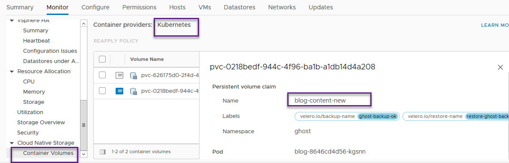
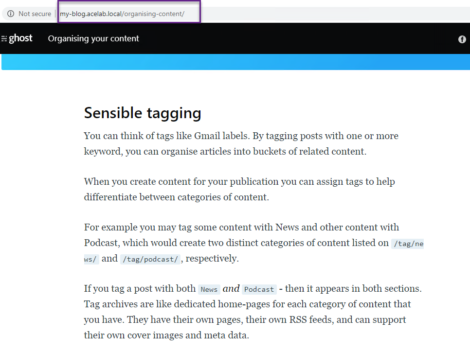

VMware Advanced Customer Engagements (ACE) Team

Contents:

Introduction 2

Overview of Persistent Storage Concepts and Cloud Native Storage 2

Persistent Volumes and Persistent Volume Claims 2

Cloud Native Storage Concepts 3

vSphere CNS Architecture 3

Prerequisites for CNS with TGKI 5

Installing CSI Driver on a TGKI K8s Cluster 5

Deploy Stateful Containerized Application 11

Conclusion 16

Introduction
------------

This document is a quick start guide to show how to deploy stateful
applications on Kubernetes (K8s) clusters provisioned by Tanzu
Kubernetes Grid Integrated (TKGI, formerly known as Enterprise PKS)
using Cloud Native Storage (CNS) persistent volumes. This document will
provide details on configuration of CNS/CSI drivers in designated K8s
cluster and deploying a stateful application using K8s storage class
with CNS/CSI driver.

A stateful containerized application 'Ghost', defined and
[shared](https://github.com/beyondelastic/velero_vSphere) by [Alexander
Ullah](mailto:aullah@vmware.com?subject=Thanks%20for%20publishing%20TKG*%20CSI%20%22how%20to%22%20blog!)
is used to demonstrate the use of persistence volumes.

Overview of Persistent Storage Concepts and Cloud Native Storage
----------------------------------------------------------------

In this section we provide a brief overview of K8s storage primitives
and provide architectural overview of Cloud Native Storage (CNS)
pluggable architecture that implements those primitives.

### Persistent Volumes and Persistent Volume Claims

K8s
[PersistentVolume](https://kubernetes.io/docs/concepts/storage/persistent-volumes/)
subsystem provides a plugin based API for that abstracts details of how
storage is *provided* from how it is *consumed*. That maps to API
resources: *PersistentVolume* and *PersistentVolumeClaim*.

A *PersistentVolume* (PV) is a piece of storage in the cluster that has
been provisioned statically or dynamically, using [Storage
Classes](https://kubernetes.io/docs/concepts/storage/storage-classes/).
PVs are volume plugins like
[Volumes](https://kubernetes.io/docs/concepts/storage/volumes/)
(essentially directories accessible to all containers running in a pod
that preserve data across container restarts) - but have a lifecycle
independent of any individual Pod that uses them. PV captures the
details of the implementation of the storage (iSCSI, NFS or a
cloud-provider-specific storage system).

A *PersistentVolumeClaim* (PVC) is a request for storage by a user to
consume PV resources, like a Pod requests to consume node resources.
PVCs can request specific size and access modes (e.g., they can be
mounted with *ReadWriteOnce*, *ReadOnlyMany* or *ReadWriteMany*
[AccessModes](https://kubernetes.io/docs/concepts/storage/persistent-volumes/#access-modes)).

Cluster administrators need to be able to provision PVs that differ in
multiple parameters besides size and access modes, without exposing
users to the details of how those volumes are implemented. For these
needs, there is *StorageClass* K8s resource

### Cloud Native Storage Concepts

Cloud Native Storage
([CNS](file:///C:\Temp\(https:\docs.vmware.com\en\VMware-vSphere\6.7\Cloud-Native-Storage\GUID-CF1D7196-E49C-4430-8C50-F8E35CAAE060.html)))
provides comprehensive data management for stateful, containerized apps,
enabling them to survive restarts and outages.

-   **Container Storage Interface** (CSI) is effectively an API between
    container orchestrators and storage providers to allow consistent
    interoperability. CSI implements all the volume life-cycle tasks
    (i.e. create, attach, detach, delete, mount, unmount).

-   **Cloud Provider Interface** (CPI), referred to as the Cloud
    Controller Manager (CCM) in the past. As there are numerous public
    and on-premise private cloud providers offering Kubernetes, it was
    decided that some of the tasks (control loops) previously handled by
    the core K8s controller should also be moved out of core source code
    and into a CPI plugin format. They perform several tasks: Initialize
    a node with cloud specific zone/region labels and other cloud
    specific instance details such as type and size.

CSI in conjunction with CPI allows for intelligent placement of Pods and
PVs on vSphere infrastructure (across Datacenters, Clusters, Hosts etc.)

### vSphere CNS Architecture

Being a major contributor into Kubernetes project, VMware is also
embracing the trend towards more open source components. The Kubernetes
vSphere CSI "out of tree" driver is becoming more popular as it
gradually replaces the original "in tree" implementation of vSphere
storage for Kubernetes, the vSphere Cloud Provider (also known as
["Project
Hatchway"](https://storagehub.vmware.com/t/project-hatchway/)). The
[vSphere CSI](https://github.com/kubernetes-sigs/vsphere-csi-driver) and
[vSphere CCM](https://github.com/kubernetes/cloud-provider-vsphere)
drivers are available on GitHub along with related documentation. They
are available for public use and supported components within VMware
commercial offerings.

CNS vSphere offers the following two components:

-   CNS in vCenter Server

-   vSphere volume driver in Kubernetes cluster

CNS control plane introduces a concept of volumes: **container volumes
and persistent volumes** in vSphere. It is the Storage control plane for
container volumes responsible for managing the lifecycle of volumes
(including CRUD operations), also responsible for managing volume
metadata, snapshots and restore, volume copy and clone, and monitoring
the health and compliance of volumes.

These volumes are independent of the VM lifecycle and have their own
identity in vSphere.

CNS supports ***block volumes*** backed by First Class Disk (FCD) and
***file volumes*** backed by vSAN file shares.

A ***block volume*** can only be attached to one Kubernetes pod with
***ReadWriteOnce*** access mode at any point in time. A ***file
volume*** can be attached to one or more pods with
***ReadWriteMany/ReadOnlyMany*** access modes.

In K8s, CNS provides a volume driver that has two sub-components: the
**CSI driver** and the **syncer**.

-   The **CSI driver** is responsible for volume provisioning, attaching
    and detaching the volume to VMs, mounting, formatting and unmounting
    volumes from the pod within the node VM, etc. The CSI driver is
    built as an ["out-of-tree" CSI
    plugin](https://cloud-provider-vsphere.sigs.k8s.io/concepts/in_tree_vs_out_of_tree.html)
    for K8s.

-   The **syncer** is responsible for pushing PV, PVC, and pod metadata
    to CNS. It also has a CNS operator that is used in the context of
    vSphere with Kubernetes.

Stateful containers can use vSphere storage primitives - standard
volume, persistent volume, and dynamic provisioning - independent of VM
and container lifecycles. vSphere storage backs the volumes, and we can
set a storage policy directly on the volumes.

After creation of volumes, we can review them and their backing virtual
disks, and monitor their storage policy compliance using vSphere client.

Prerequisites for CNS with TGKI
-------------------------------

(See [documentation](https://docs.pivotal.io/tkgi/1-8/vsphere-cns.html)
for complete list of pre-requisites)

-   vSphere v6.7U3 or later

-   NSX-T version compatible with vSphere version above

    -   NSX-T v2.4.0 and later, compatible with vSphere v6.7U3 (see
        [VMware Platform Interoperability
        Matrix](https://www.vmware.com/resources/compatibility/sim/interop_matrix.php#interop&644=4122,4714,3954&229=3345&1=3495,3456,3221&2=3496,3457,3222,2862,2736,3364,2732)
        for all versions)

-   TKGI v1.7.0 or later

    -   Support upgrading virtual hardware version on Kubernetes cluster
        VMs

-   Firewall and network configuration:

-   Enable the following components to access vCenter:

    -   Cluster master nodes

    -   Cluster worker nodes, so their CSI components can provision
        their disks

    -   All Pods running CSI components

-   TKGI K8s cluster plan configuration:

> In the TKGI tile, configure a Plan with the "Allow Privileged"
> checkbox enabled, so containers run in privileged mode

Installing CSI Driver on a TGKI K8s Cluster
-------------------------------------------

Following are the steps to install CSI driver on a K8S cluster
provisioned by TKGI (formerly 'Enterprise PKS'):

NOTE: below steps were validated using TKGI 1.7.0 and 1.8.0 releases

1.  Create CSI Secret for vSphere based on provided sample deployment
    file (*csi-vsphere.conf* in the 'samples' repository folder, also
    shown below)

> \[Global\]
>
> cluster-id = PKS-COMPUTE-EDGES
>
> \[VirtualCenter \"192.168.2.20\"\]
>
> insecure-flag = \"true\"
>
> user = \"administrator\@vsphere.local\"
>
> password = \"XXXXXX\"
>
> port = \"443\"
>
> datacenters = \"PKS-NESTED-DC2\"

NOTES:

-   *cluster-id* is a unique identifier, can be a name of vSphere
    > cluster which data store will be used

-   *VirtualCenter* contains IP address (FQDN) of vSphere vCenter

-   *user* and *password* are credentials of vSphere admin user (or user
    > with sufficient access level)

-   *datacenters* are vSphere Data center(s) where clusters are
    > contained

> Create a secret for accessing vSphere Data Center/Cluster
>
> **kubectl create secret generic vsphere-config-secret
> \--from-file=csi-vsphere.conf \--namespace=kube-system**
>
> secret/vsphere-config-secret created

2.  Create RBAC objects for CSI access based on provided sample
    deployment file (*vsphere-csi-controller-rbac.yaml* in the 'samples'
    repository folder, also shown below)

>     kind: ServiceAccount
>     apiVersion: v1
>     metadata:
>       name: vsphere-csi-controller
>       namespace: kube-system
>     ---
>     kind: ClusterRole
>     apiVersion: rbac.authorization.k8s.io/v1
>     metadata:
>       name: vsphere-csi-controller-role
>     rules:
>       - apiGroups: [""]
>         resources: ["nodes", "persistentvolumeclaims", "pods"]
>         verbs: ["get", "list", "watch"]
>       - apiGroups: [""]
>         resources: ["persistentvolumes"]
>         verbs: ["get", "list", "watch", "create", "update", "delete"]
>       - apiGroups: [""]
>         resources: ["events"]
>         verbs: ["get", "list", "watch", "create", "update", "patch"]
>       - apiGroups: ["storage.k8s.io"]
>         resources: ["storageclasses"]
>         verbs: ["get", "list", "watch"]
>       - apiGroups: ["storage.k8s.io"]
>         resources: ["csinodes"]
>         verbs: ["get", "list", "watch"]
>       - apiGroups: ["storage.k8s.io"]
>         resources: ["volumeattachments"]
>         verbs: ["get", "list", "watch", "update"]
>     ---
>     kind: ClusterRoleBinding
>     apiVersion: rbac.authorization.k8s.io/v1
>     metadata:
>       name: vsphere-csi-controller-binding
>     subjects:
>       - kind: ServiceAccount
>         name: vsphere-csi-controller
>         namespace: kube-system
>     roleRef:
>       kind: ClusterRole
>       name: vsphere-csi-controller-role
>       apiGroup: rbac.authorization.k8s.io
>
> **\-\-\-\-\-\-\-\-\-\-\-\-\-\-\-\-\-\--**
>
> **kubectl apply -f vsphere-csi-controller-rbac.yaml**
>
> serviceaccount/vsphere-csi-controller created\
> clusterrole.rbac.authorization.k8s.io/vsphere-csi-controller-role
> created\
> clusterrolebinding.rbac.authorization.k8s.io/vsphere-csi-controller-binding
> created
>
> Verify that created Service account, Cluster roles/Cluster role
> bindings exist in 'kube-system' namespace:
>
> **kubectl get serviceaccounts -n kube-system**
>
> NAME SECRETS AGE
>
> .....
>
> vrealize-med01                       1         25h
>
> **vsphere-csi-controller               1         3m4s**

\-\-\-\-\-\-\-\--

> **kubectl get clusterroles -n kube-system**

NAME AGE

> vrops-cadvisor                                                        
> 47h
>
> **vsphere-csi-controller-role                             \<invalid\>**

\-\-\-\-\-\-\-\-\--

> **kubectl get clusterrolebindings -n kube-system**
>
> NAME AGE
>
> .....
>
> vrops-cadvisor                                         47h
>
> **vsphere-csi-controller-binding                        \<invalid\>**

3.  Install the vSphere CSI Driver using sample manifest file
    (*vsphere-csi-controller-ss.yaml* in the 'samples' repository
    folder)

> **kubectl apply -f vsphere-csi-controller-ss.yaml**\
> statefulset.apps/vsphere-csi-controller created\
> csidriver.storage.k8s.io/csi.vsphere.vmware.com created

   

Optionally, monitor events in kube-system namespace to check
initialization of *vsphere-csi-controller* pods:

> **kubectl get events -n kube-system**
>
> LAST SEEN   TYPE     REASON            
> OBJECT                               MESSAGE\
> \<unknown\>   Normal  
> Scheduled      pod/vsphere-csi-controller-0         Successfully
> assigned kube-system/vsphere-csi-controller-0 to
> a208e18a-fbe4-4e36-a17f-6efe7c204d78\
> 27s         Normal   Pulling           
> pod/vsphere-csi-controller-0         Pulling image
> \"[quay.io/k8scsi/csi-attacher:v1.1.1](http://quay.io/k8scsi/csi-attacher:v1.1.1)\"\
> 22s         Normal   Pulled            
> pod/vsphere-csi-controller-0         Successfully pulled image
> \"[quay.io/k8scsi/csi-attacher:v1.1.1](http://quay.io/k8scsi/csi-attacher:v1.1.1)\"\
> 20s         Normal   Created           
> pod/vsphere-csi-controller-0         Created container csi-attacher\
> 20s         Normal   Started           
> pod/vsphere-csi-controller-0         Started container csi-attacher\
> 20s         Normal   Pulling           
> pod/vsphere-csi-controller-0         Pulling image
> \"[gcr.io/cloud-provider-vsphere/csi/release/driver:v1.0.2](http://gcr.io/cloud-provider-vsphere/csi/release/driver:v1.0.2)\"\
> 7s          Normal   Pulled            
> pod/vsphere-csi-controller-0         Successfully pulled image
> \"[gcr.io/cloud-provider-vsphere/csi/release/driver:v1.0.2](http://gcr.io/cloud-provider-vsphere/csi/release/driver:v1.0.2)\"\
> 3s          Normal   Created           
> pod/vsphere-csi-controller-0         Created container
> vsphere-csi-controller\
> 2s          Normal   Started           
> pod/vsphere-csi-controller-0         Started container
> vsphere-csi-controller\
> 2s          Normal   Pulling           
> pod/vsphere-csi-controller-0         Pulling image
> \"[quay.io/k8scsi/livenessprobe:v1.1.0](http://quay.io/k8scsi/livenessprobe:v1.1.0)\"\
> 30s         Normal   SuccessfulCreate  
> statefulset/vsphere-csi-controller   **create Pod
> vsphere-csi-controller-0 in StatefulSet vsphere-csi-controller
> successful**

4.  Install CSI Driver DaemonSet using sample manifest file
    (*vsphere-csi-node-ds.yaml* included into 'samples' repository
    folder)

> **kubectl apply -f vsphere-csi-node-ds.yaml**
>
> daemonset.apps/vsphere-csi-node created
>
> Verify that DaemonSet (that is guaranteed running Pod/Node) is running
> on all cluster nodes:
>
> **kubectl get ds -n kube-system**
>
> NAME       DESIRED   CURRENT   READY   UP-TO-DATE   AVAILABLE   NODE
> SELECTOR   AGE
>
> vsphere-csi-node   4         4         4       4            4     
> \<none\>         
>
> 2m8s

5.  Verify that CSI Driver Deployed Successfully

  Check that all pods are running in the **kube-system** namespace (look
for **vsphere-csi-...** pod names)

> **kubectl get po \--namespace=kube-system**
>
> NAME                              READY   STATUS            
> RESTARTS   AGE
>
> NAME READY STATUS RESTARTS AGE
>
> coredns-5b6649768f-7zzfr 1/1 Running 0 97m
>
> coredns-5b6649768f-8rg9m 1/1 Running 0 97m
>
> coredns-5b6649768f-c4ktq 1/1 Running 0 97m
>
> metrics-server-7f9887fbb5-64rtk 1/1 Running 0 97m
>
> **vsphere-csi-controller-0 5/5 Running 0 7m**
>
> **vsphere-csi-node-b47k4            3/3     Running           
> 0          5m45s**
>
> **vsphere-csi-node-cvcm2            3/3     Running           
> 0          5m45s**
>
> **vsphere-csi-node-fxfsj            3/3     Running           
> 0          5m45s**
>
> **vsphere-csi-node-p4wgc            3/3     Running           
> 0          5m45s**

6.  Verify that CRDs for CSI are deployed and activated:

> **kubectl get CSINode**
>
> NAME                                   CREATED AT\
> **23f8a803-50de-4d2a-be42-5f4482f35fb3**    2020-06-25T19:31:44Z\
> 3f178b02-514c-415d-9716-470b30175b44  2020-06-30T05:11:41Z\
> 576e0ba9-5621-4ecd-a1b1-eb39af781390   2020-06-25T19:31:42Z\
> 9dcd874c-c86e-4b59-af77-c914619fd38c    2020-06-25T19:23:29Z
>
> **kubectl describe CSINode**
>
> Name:         23f8a803-50de-4d2a-be42-5f4482f35fb3\
> Namespace:\
> Labels:       \<none\>\
> Annotations:  \<none\>\
> API Version:  storage.k8s.io/v1beta1\
> Kind:         CSINode\
> Metadata:\
>   Creation Timestamp:  2020-06-25T19:31:44Z\
>   Owner References:\
>     API Version:     v1\
>     Kind:            Node\
>     Name:          **23f8a803-50de-4d2a-be42-5f4482f35fb3**\
>     UID:             2e495151-1a4a-4aac-baab-f5182b504e21\
>   Resource Version:  7801510\
>   Self Link:        
> /apis/[storage.k8s.io/v1beta1/csinodes/23f8a803-50de-4d2a-be42-5f4482f35fb3](http://storage.k8s.io/v1beta1/csinodes/23f8a803-50de-4d2a-be42-5f4482f35fb3)\
>   UID:               ef1d6c57-3965-499b-8493-5952e454dadc\
> Spec:\
>   Drivers:\
>     Name:           csi.vsphere.vmware.com\
>     Node ID:        **23f8a803-50de-4d2a-be42-5f4482f35fb3 matches
> name**\
>     Topology Keys:  \<nil\>\
> Events:             \<none\>\
> \
> ....

7.  Verify that CSI Driver is installed\
    \
    **kubectl get csidrivers**\
    NAME                     CREATED AT\
    csi.vsphere.vmware.com   2020-07-03T02:42:08Z

### 

8.  Verify that CSI ProviderID was added to all Cluster Nodes

> ** kubectl describe nodes \| grep \"ProviderID\"**\
> ProviderID:                  
> vsphere://421c57b9-99bb-ef5a-c2d4-38b857f8d9d5\
> ProviderID:                  
> vsphere://421cef46-3327-d66c-4d52-5e6f2bb1bfaa\
> ProviderID:                  
> vsphere://421c04c4-13fd-069e-c2a9-d13166d81a4c\
> ProviderID:                  
> vsphere://421ce760-a829-deb2-82d9-45ff4fc5ec95

**At this point, we verified that CSI driver is running on all cluster
nodes and ready to deploy a stateful application using this driver.**

Deploy Stateful Containerized Application
-----------------------------------------

> We will use simple Ghost blogging application that preserves its state
> (blog entries, configuration settings, users' data) using PVs. As can
> be seen from its deployment descriptor below, it has a very simple
> structure of a Deployment that spans a single stateful Pod and a
> Service of Load Balancer type that exposes that deployment for
> external access.

1.  Create storage class that is using CSI driver (using
    *csi-sc-dan.yaml* deployment descriptor file available in 'samples'
    folder and shown below)

>     apiVersion: storage.k8s.io/v1
>     kind: StorageClass
>     metadata:
>       name: demo-sts-sc
>       annotations:
>         storageclass.kubernetes.io/is-default-class: "true"
>     provisioner: csi.vsphere.vmware.com
>     parameters:
>       datastoreurl: "ds:///vmfs/volumes/13e49faf-a5872633/"
>
> NOTES:

-   provisioner: *csi.vsphere.vmware.com* points to vSphere CSI driver

-   *datastoreurl* should point to a folder path in the associated
    > vSphere Data Store:

> 
>
> **kubectl apply -f csi-sc-dan.yaml -n ghost**
>
> storageclass.storage.k8s.io/demo-sts-sc created
>
> Verify that storage class object has been created at K8s cluster
> level:
>
> **kubectl get sc**
>
> NAME PROVISIONER RECLAIMPOLICY VOLUMEBINDINGMODE ALLOWVOLUMEEXPANSION
> AGE
>
> **demo-sts-sc** (default) csi.vsphere.vmware.com Delete Immediate
> false 4m40s

2.  Create PVC referencing above storage class (*ghost-claim.yaml*
    sample deployment descriptor in the 'samples' repository folder,
    also shown below)

>     kind: PersistentVolumeClaim
>     apiVersion: v1
>     metadata:
>       name: blog-content-new
>       namespace: ghost
>       annotations:
>         volume.beta.kubernetes.io/storage-class: demo-sts-sc
>     spec:
>       accessModes:
>         - ReadWriteOnce
>       resources:
>         requests:
>           storage: 2Gi
>
> Run the following command:
>
> **kubectl apply -f ghost-claim.yaml**
>
> persistentvolumeclaim/blog-content-new created
>
> NOTE: on vSphere UI we can monitor tasks of creation of persistent
> volume:
>
> 
>
> Verify that PVC is in "bound" state:
>
> **kubectl get pvc -n ghost**
>
> NAME STATUS VOLUME CAPACITY ACCESS MODES STORAGECLASS AGE
>
> **blog-content-new** Bound pvc-0218bedf-944c-4f96-ba1b-a1db14d4a208
> 2Gi RWO demo-sts-sc 5d1h***2Gi        RWO    demo-sts-sc    119s***
>
> NOTES:

-   if PVC is not in **Bound** state after a while (e.g. remains in
    **Pending)** -- that means it cannot be used by pods. Examine events
    log in the K8s cluster and try to resolve the issue.

-   As mentioned above, Cloud Administrator can view CNS Persistent
    volumes provisioned in Datastore via Monitor Cloud Native Storage
    Container Volumes view of vSphere client

> 

3.  Deploy Ghost stateful application that uses **blog-content-new** PVC
    created above to mount its **content** volume (use *ghost-new.yaml*
    sample deployment descriptor file in the 'samples' folder also shown
    below):

>     apiVersion: v1
>     kind: Service
>     metadata:
>       labels:
>         name: blog
>       name: blog
>       namespace: ghost
>     spec:
>       ports:
>         - port: 80
>           targetPort: 2368
>       selector:
>         app: blog
>       type: LoadBalancer
>
>     ---
>
>     apiVersion: apps/v1
>     kind: Deployment
>     metadata:
>       name: blog
>       namespace: ghost
>       labels:
>         app: blog
>     spec:
>       replicas: 1
>       selector:
>         matchLabels:
>           app: blog
>       template:
>         metadata:
>           labels:
>             app: blog
>         spec:
>           containers:
>           - name: blog
>             image: ghost:latest
>             imagePullPolicy: Always
>             ports:
>             - containerPort: 2368
>             env:
>             - name: url
>               value: http://my-blog.acelab.local
>             volumeMounts:
>             - mountPath: /var/lib/ghost/content
>               name: content
>           volumes:
>           - name: content
>             persistentVolumeClaim:
>               claimName: blog-content-new
>
> NOTES:

-   Value of *url* environment variable should have a DNS record
    > matching value of EXTERNAL-IP shown in the next step in order to
    > access application by its URL, e.g. http://my-blog.acelab.local

-   Value of *claimName* should match name of PVC created in previous
    > steps

\-\-\-\-\-\-\-\-\-\-\-\-\-\-\-\-\-\-\-\-\-\-\-\-\-\-\-\-\-\-\-\-\-\-\-\-\-\-\-\-\-\-\-\-\-\-\--

Deploy Ghost stateful application:

**kubectl apply -f ghost-new.yaml**

> service/blog created
>
> deployment.apps/blog created

4.  Verify that all application objects have been created in the
    destination K8s namespace:

> **kubectl get all -n ghost**
>
> NAME                        READY   STATUS    RESTARTS   AGE
>
> pod/blog-8646cd4d56-fpqz9   1/1     Running   0          10m
>
> NAME           TYPE           CLUSTER-IP       EXTERNAL-IP    
> PORT(S)        AGE
>
> service/blog   LoadBalancer   10.100.200.102   **192.168.74.81** 
> 80:35713/TCP   10m
>
> NAME          READY   UP-TO-DATE   AVAILABLE   AGE
>
> deployment.apps/blog   1/1     1            1           10m
>
> To access the ghost application, navigate to the URL defined by
> EXTERNAL-IP address of LoadBalancer service (and corresponding DNS
> record) to access the Ghost application UI:
>
> 
>
> Now we can start using the Ghost application as it is intended --
> posting blogs, tagging contents etc. The configuration settings and
> published blog content will be saved in the 'content' volume that is
> using vSphere based persistent storage.
>
> 

NOTE: Other, more complex multi-tier applications using Persistent
volumes for Database tier (e.g. popular
[Yelb](https://github.com/mreferre/yelb) restaurant review application)
can be successfully deployed using CNS Storage Class/PVCs similarly, as
we verified in our Lab.

Conclusion
----------

In this post, we have refreshed understanding of Persistent storage
concepts in K8s, reviewed details of the "out-of-tree " vSphere Cloud
Native Storage (CNS) architecture and components, and walked through CSI
driver installation and usage on TKGI cluster for deployment of a
stateful containerized application Ghost.

We hope this document was useful. As you try these configuration steps,
please provide any feedback or questions in the comments section for
this document on
[code.vmware.com](file:///C:\Users\dzilberman\OneDrive%20-%20VMware,%20Inc\VMwareCorp\Documents\VMware\Branding\Branded%20Word%20Templates\code.vmware.com).
Also, please let us know if you have any suggestions or if you would
like to see guidance on other topics.
